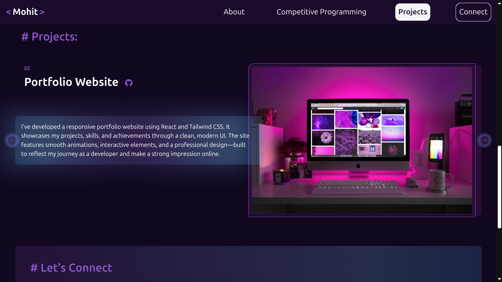

# 💼 Personal Developer Portfolio



🔗 **Live Website**: [View Portfolio on GitHub Pages](https://mohitjaint.github.io/Portfolio-Website)

---

## 📌 Overview

This is a fully responsive and animated **portfolio website** that showcases my skills and interests **Web Development**.
I built this website using **React** + **Tailwindcss**.
The website features smooth section scrolling, glowing UI effects, and modular React components.

---

## 🛠 Built With

- ⚛️ [React](https://reactjs.org/)
- ⚡ [Vite](https://vitejs.dev/)
- 🎨 [Tailwind CSS](https://tailwindcss.com/)
- 🖼️ Icons sourced from [Icons8](https://icons8.com)

---

## 📚 What I Learned

- Implementing smooth **scroll-based navigation** with `scroll-mt` to prevent header overlap.
- Designing **modular and reusable React components** for cards and sections.
- Adding **hover glow animations** and responsive UI with Tailwind.
- Hosting a Vite + React app using **GitHub Pages**.
- Using `gh-pages` package to automate deployment.

---

## 🚀 Run Locally

To run the project locally on your machine:

1. **Clone the repository**
   ```bash
   git clone https://github.com/your-username/your-repo-name.git
   cd your-repo-name
   ```
2. **Install dependencies**
   ```bash
   npm install
   ```
3. **Start the development server**
   ```bash
   npm run dev
   ```
4. **Visit**

- Open your browser and go to: http://localhost:5173
